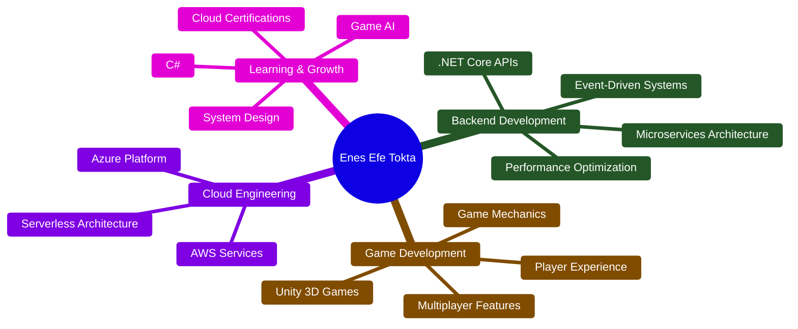

<div align="center">

# 🚀 Enes Efe Tokta

[](https://git.io/typing-svg)

📍 **Erzurum, Turkey** | 🌈 **Open to Global Remote Opportunities**

[](https://www.linkedin.com/in/enes-efe-tokta)
[](mailto:enesefetokta009@gmail.com)
[](https://enes-efe-tokta.itch.io/)
[](https://github.com/EnesEfeTokta)

</div>

---

## Professional Profile

```csharp
public class EnesEfeTokta : IDeveloper, IGameCreator, ICloudArchitect
{
    public Profile Information => new()
    {
        Location = "Erzurum, Turkey 🇹🇷",
        Availability = "Remote • Europe • North America",
        Experience = new[] { 
            "Backend Architecture", 
            "Game Development", 
            "Cloud Engineering",
            "Mobile Development"
        },
        CurrentFocus = "Microservices & Cloud-Native Architecture",
        Passion = "Building scalable systems and immersive gaming experiences"
    };

    public TechStack Skills => new()
    {
        Backend = new[] { "C#", ".NET Core", "ASP.NET", "Microservices", "REST APIs" },
        GameDev = new[] { "Unity Engine", "C#", "Game Design", "Blender 3D" },
        Cloud = new[] { "AWS", "Azure", "Docker", "Kubernetes", "Serverless" },
        Database = new[] { "PostgreSQL", "Redis", "Supabase", "SQL Server" },
        Mobile = new[] { "Kotlin", "Android SDK", "Mobile Architecture" }
    };
}
```

---

## Core Competencies

<table>
<tr>
<td width="33%" align="center">

**Backend Engineering**

Building distributed systems with .NET Core that handle millions of requests with high availability and fault tolerance.

Microservices Architecture • RESTful APIs  
Event-Driven Systems • CQRS & DDD

</td>
<td width="33%" align="center">

**Game Development**

Creating engaging gameplay experiences from concept to deployment with focus on performance and player satisfaction.

Unity 3D Games • Multiplayer Features  
Game Mechanics • Cross-Platform

</td>
<td width="33%" align="center">

**Cloud Architecture**

Designing and implementing scalable, resilient cloud infrastructure on AWS and Azure platforms.

Container Orchestration • Serverless  
CI/CD Pipelines • Infrastructure as Code

</td>
</tr>
</table>

---

## Technology Stack

<div align="center">

### Programming Languages & Frameworks


### Cloud & DevOps


### Databases & Tools


</div>

---

## Achievements & Certifications

<div align="center">

| Achievement | Details | Year |
|:-------------:|-----------|:--------:|
| 🥇 **Google Game & App Academy** | Top 7 Finalist among 3,000+ participants | 2024 |
| 📜 **Google Project Management** | Professional Certificate | 2024 |
| ☁️ **AWS Solutions Architect** | Learning Path Completed | 2024 |
| 🔷 **Microsoft Azure Fundamentals** | AZ-900 Preparation | 2024 |


</div>

---

## GitHub Statistics

<div align="center">


</div>

---

## Contribution Activity

<div align="center">


</div>

---

## Current Focus & Projects

<div align="center">



</div>

**Active Projects:**
- Building microservices architecture with .NET Core and CQRS patterns
- Developing scalable real-time multiplayer systems with Unity
- Creating serverless applications on AWS Lambda and Azure Functions
- Building Android applications with modern Kotlin architecture

---

## Development Principles

<table>
<tr>
<td width="50%">

**Architecture & Design**

- SOLID Principles
- Clean Architecture
- Domain-Driven Design
- Microservices Patterns
- Event-Driven Architecture
- Test-Driven Development

</td>
<td width="50%">

**Professional Standards**

- Code Reviews & Pair Programming
- Continuous Integration/Deployment
- Comprehensive Documentation
- Performance Monitoring
- Security Best Practices
- Agile & Scrum Methodologies

</td>
</tr>
</table>

<div align="center">

> *"First, solve the problem. Then, write the code."* - John Johnson

</div>

---

## Contribution Visualization

<div align="center">
  
  
  <br>
  
  
</div>

---

## Let's Connect

<div align="center">

**I'm Open To:**

Remote Opportunities • Freelance Projects • Open Source Contributions • Technical Consulting • Mentorship

### Get In Touch

[](https://www.linkedin.com/in/enes-efe-tokta)
[](mailto:enesefetokta009@gmail.com)
[](https://enes-efe-tokta.itch.io/)

**Available for Remote Work: Europe • North America • Global Projects**

</div>

---

<div align="center">


**⭐ From [EnesEfeTokta](https://github.com/EnesEfeTokta) • Crafted with 💜 and ☕**

```
"The best way to predict the future is to implement it." 🚀
```

</div>
